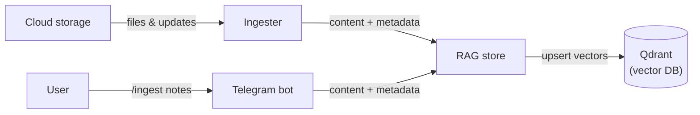
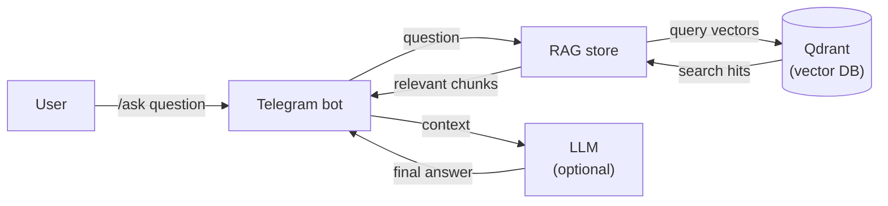

# Google Drive assistant bot

[](https://github.com/hu553in/gdrive-assistant-bot/actions/workflows/ci.yml)

- [License](./LICENSE)
- [Contributing](./CONTRIBUTING.md)
- [Code of conduct](./CODE_OF_CONDUCT.md)

Semantic search and Q&A Telegram bot for Google Drive, backed by Qdrant and an optional
OpenAI-compatible LLM.

## What it does

- Recursively indexes documents from specific Google Drive folders or everything accessible to the account
- Splits content into chunks, generates embeddings, and stores them in Qdrant
- Answers questions via `/ask` using semantic search
- Optionally uses an OpenAI-compatible LLM to generate final answers
- Accepts manual notes from Telegram via `/ingest`

LLM usage is optional. Without it, the bot returns the most relevant text fragments.

## Supported file types

- Google Docs
- Google Sheets
- Google Slides
- Text-based files (configuration files, source code, plain text)
- PDF documents
- Microsoft Office formats (DOC, DOCX, XLS, XLSX, PPT, PPTX)

## Components

- **ingest** - background service that syncs cloud files to Qdrant
- **bot** - Telegram interface for asking questions and adding notes
- **qdrant** - vector database for embeddings and search
- **llm** (optional) - OpenAI-compatible model for answer generation

## Architecture

The system consists of three main components: ingestion, retrieval, and answering.
Files are indexed in the background and queried via a Telegram bot.

### System flows

#### Ingestion


```mermaid
flowchart LR
    U[User]
    CS[Cloud storage]
    ING[Ingester]
    BOT[Telegram bot]
    RAG[RAG store]
    QD[("Qdrant<br>(vector DB)")]

    U -->|/ingest notes| BOT
    CS -->|files & updates| ING
    ING -->|content + metadata| RAG
    BOT -->|content + metadata| RAG
    RAG -->|upsert vectors| QD
```

#### Retrieval and answering


```mermaid
flowchart LR
    U[User]
    BOT[Telegram bot]
    RAG[RAG store]
    QD[("Qdrant<br>(vector DB)")]
    LLM["LLM<br>(optional)"]

    U -->|/ask question| BOT
    BOT -->|question| RAG
    RAG -->|query vectors| QD
    QD -->|search hits| RAG
    RAG -->|relevant chunks| BOT
    BOT -->|context| LLM
    LLM -->|final answer| BOT
```

## Quick start

1. Copy environment config: `cp .env.example .env`
2. Configure Google Drive access:
   - Create a Google service account
   - Download its JSON key
   - Place it at `secrets/google_sa.json`
   - Share target Google Drive folders with the service account email
   - Enable Google Drive API, Google Docs API, Google Sheets API, and Google Slides API
3. Set required environment variables:
   - `TELEGRAM_BOT_TOKEN`
   - Either `STORAGE_GOOGLE_DRIVE_FOLDER_IDS` (JSON array) or `STORAGE_GOOGLE_DRIVE_ALL_ACCESSIBLE=true`
4. Start services: `make start`

### Google APIs and scopes

Uses Drive, Docs, Sheets, and Slides APIs (read-only scopes). The service account needs the
corresponding APIs enabled and folders shared with its email.

## Development

Useful commands:

```bash
make install-deps
make check
make start
make stop
```

## Access control (optional)

By default, the bot is publicly accessible. Access control variables:

- `TELEGRAM_ALLOWED_USER_IDS` - a JSON array of Telegram user IDs
  allowed to interact with the bot in private chats
- `TELEGRAM_ALLOWED_GROUP_IDS` - a JSON array of Telegram group or supergroup IDs
  where the bot is allowed to respond

Behavior:

- If both lists are empty (default), the bot responds to everyone
- If user IDs are set, only those users can use the bot in private chats
- If group IDs are set, the bot responds only in those groups (any member can use it there)
- If access is not allowed, the bot silently ignores the message

Telegram user and group IDs can be found with bots like [@userinfobot](https://userinfobot.t.me)
or [@getidsbot](https://getidsbot.t.me).

## Telegram commands

- `/start` - show help
- `/ask <question>` - search the knowledge base and answer
- `/ingest <text>` - manually add a note to the knowledge base

## Configuration

All settings are defined via `.env`.

| Name                                  | Required    | Default                                                       | Description                |
| ------------------------------------- | ----------- | ------------------------------------------------------------- | -------------------------- |
| `TELEGRAM_BOT_TOKEN`                  | Yes         | -                                                             | Telegram bot token         |
| `STORAGE_GOOGLE_DRIVE_FOLDER_IDS`     | Conditional | `[]`                                                          | Folder IDs (JSON array)    |
| `STORAGE_GOOGLE_DRIVE_ALL_ACCESSIBLE` | Conditional | `false`                                                       | Index all accessible files |
| `QDRANT_URL`                          | No          | `http://qdrant:6333`                                          | Qdrant endpoint            |
| `LLM_API_KEY`                         | No          | -                                                             | LLM API key (optional)     |
| `LLM_MODEL`                           | No          | `gpt-4o-mini`                                                 | LLM model name             |
| `EMBED_MODEL`                         | No          | `sentence-transformers/paraphrase-multilingual-MiniLM-L12-v2` | fastembed model            |

See `.env.example` for all available options including rate limits, timeouts, file type toggles,
and health check ports.

Set either `STORAGE_GOOGLE_DRIVE_FOLDER_IDS` (JSON array) or `STORAGE_GOOGLE_DRIVE_ALL_ACCESSIBLE=true`
when using the Google Drive provider. The service account JSON key must exist at the configured
`STORAGE_GOOGLE_DRIVE_SERVICE_ACCOUNT_JSON` path (default: `/run/secrets/google_sa`).
