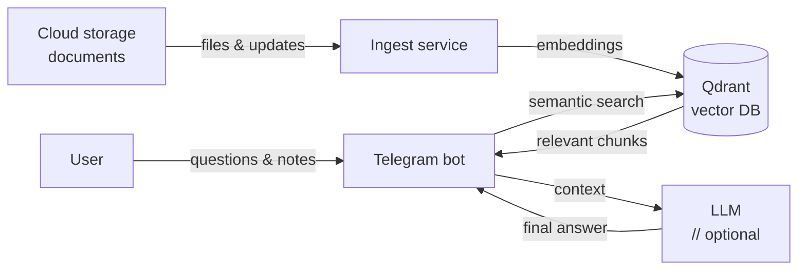

# Google Drive assistant bot

- [License](./LICENSE)
- [How to contribute](./CONTRIBUTING.md)
- [Code of conduct](./CODE_OF_CONDUCT.md)

Semantic search and Q&A Telegram bot for Google Drive — powered by Qdrant and an optional OpenAI-compatible LLM.

---

## Why this project

If your Google Drive is full of documents and you keep asking questions like:

- "What did I write last January?"
- "Is there any document mentioning X?"
- "Does my work Google Drive actually contain anything about this?"

This bot turns Google Drive into a searchable knowledge base — and answers directly in Telegram.

---

## What it does

- Recursively indexes documents from Google Drive, from:
  - specific folders, or
  - everything accessible to the account
- Splits content into chunks, generates embeddings, and stores them in Qdrant
- Answers questions via `/ask` using semantic search
- Optionally uses an OpenAI-compatible LLM to generate final answers
- Accepts manual notes from Telegram via `/ingest`

LLM usage is optional. Without it, the bot returns the most relevant text fragments.

---

## Supported file types

Currently supported:

- Google Docs
- Google Sheets

Planned:

- Google Slides
- Text-based files (configuration files, source code, plain text)
- PDF documents
- Microsoft Office formats (DOC, DOCX, XLS, XLSX, PPT, PPTX)

---

## Components

- **ingest** — background service that syncs cloud files to Qdrant
- **bot** — Telegram interface for asking questions and adding notes
- **qdrant** — vector database for embeddings and search
- **llm** (optional) — OpenAI-compatible model for answer generation

---

## Architecture

The system consists of three main components: ingestion, retrieval, and answering.
Files are indexed in the background and queried via a Telegram bot.

### System flow

---

## Quick start

1. Copy environment config: `cp .env.example .env`
2. Configure Google Drive access:
   - Create a Google service account
   - Download its JSON key
   - Place it at `secrets/google_sa.json`
   - Share target Google Drive folders with the service account email
3. Set required environment variables:
   - `TELEGRAM_BOT_TOKEN`
   - `STORAGE_BACKEND=google_drive`
   - Either `STORAGE_GOOGLE_DRIVE_FOLDER_IDS` (JSON array) or `STORAGE_GOOGLE_DRIVE_ALL_ACCESSIBLE=true`
4. Start services: `make start`
5. Stop everything: `make stop`

---

## Access control (optional)

By default, the bot is publicly accessible. You can restrict access using the following options:

- Set `TELEGRAM_ALLOWED_USER_IDS` — a JSON array of Telegram user IDs
  allowed to interact with the bot in private chats
- Set `TELEGRAM_ALLOWED_GROUP_IDS` — a JSON array of Telegram group or supergroup IDs
  where the bot is allowed to respond

Behavior:

- If both lists are empty (default), the bot responds to everyone
- If user IDs are set, only those users can use the bot in private chats
- If group IDs are set, the bot responds only in those groups (any member can use it there)
- If access is not allowed, the bot silently ignores the message

To find your Telegram user or group ID, you can use bots like [@userinfobot](https://userinfobot.t.me)
or [@getidsbot](https://getidsbot.t.me).

---

## Telegram commands

- `/start` — show help
- `/ask <question>` — search the knowledge base and answer
- `/ingest <text>` — manually add a note to the knowledge base

---

## Configuration

All settings are defined via `.env`.

| Name                                              | Required    | Default                                                       | Description                                        |
| ------------------------------------------------- | ----------- | ------------------------------------------------------------- | -------------------------------------------------- |
| `TELEGRAM_BOT_TOKEN`                              | yes         | –                                                             | Telegram bot token                                 |
| `TELEGRAM_ALLOWED_USER_IDS`                       | no          | `[]`                                                          | Allowed user IDs for private messages (JSON array) |
| `TELEGRAM_ALLOWED_GROUP_IDS`                      | no          | `[]`                                                          | Allowed group IDs for group chats (JSON array)     |
| `STORAGE_BACKEND`                                 | no          | `google_drive`                                                | Storage provider identifier                        |
| `STORAGE_GOOGLE_DRIVE_SERVICE_ACCOUNT_JSON`       | no          | `/run/secrets/google_sa`                                      | Service account credentials                        |
| `STORAGE_GOOGLE_DRIVE_FOLDER_IDS`                 | conditional | `[]`                                                          | Google Drive folder IDs (JSON array)               |
| `STORAGE_GOOGLE_DRIVE_ALL_ACCESSIBLE`             | conditional | `false`                                                       | Index all accessible files                         |
| `STORAGE_GOOGLE_DRIVE_MAX_ROWS_PER_SHEET`         | no          | `10000`                                                       | Max rows per sheet                                 |
| `STORAGE_GOOGLE_DRIVE_BACKOFF_RETRIES`            | no          | `8`                                                           | Retry count for Google API                         |
| `STORAGE_GOOGLE_DRIVE_BACKOFF_BASE_DELAY_SECONDS` | no          | `1.0`                                                         | Backoff base delay                                 |
| `STORAGE_GOOGLE_DRIVE_BACKOFF_MAX_DELAY_SECONDS`  | no          | `30.0`                                                        | Backoff max delay                                  |
| `STORAGE_GOOGLE_DRIVE_API_RPS`                    | no          | `8.0`                                                         | Google API rate limit (tokens/sec)                 |
| `STORAGE_GOOGLE_DRIVE_API_BURST`                  | no          | `16.0`                                                        | Google API burst size (tokens)                     |
| `QDRANT_URL`                                      | no          | `http://qdrant:6333`                                          | Qdrant endpoint                                    |
| `QDRANT_COLLECTION`                               | no          | `docs`                                                        | Collection name                                    |
| `EMBED_MODEL`                                     | no          | `sentence-transformers/paraphrase-multilingual-MiniLM-L12-v2` | fastembed model                                    |
| `HF_TOKEN`                                        | no          | –                                                             | HuggingFace token for model downloads              |
| `TOP_K`                                           | no          | `6`                                                           | Retrieved chunks per query                         |
| `MAX_CONTEXT_CHARS`                               | no          | `6000`                                                        | Context size limit                                 |
| `LLM_BASE_URL`                                    | no          | –                                                             | OpenAI-compatible API base                         |
| `LLM_API_KEY`                                     | no          | –                                                             | LLM API key                                        |
| `LLM_MODEL`                                       | no          | –                                                             | LLM model name                                     |
| `LLM_SYSTEM_PROMPT`                               | no          | Built-in prompt                                               | LLM system prompt                                  |
| `INGEST_MODE`                                     | no          | `loop`                                                        | `once` or `loop`                                   |
| `INGEST_POLL_SECONDS`                             | no          | `600`                                                         | Poll interval                                      |
| `INGEST_WORKERS`                                  | no          | `6`                                                           | Parallel workers                                   |
| `INGEST_PROGRESS_FILES`                           | no          | `25`                                                          | Log every N files                                  |
| `INGEST_PROGRESS_SECONDS`                         | no          | `30`                                                          | Log progress at least every N sec                  |
| `INGEST_SHUTDOWN_GRACE_SECONDS`                   | no          | `20`                                                          | Graceful shutdown delay                            |
| `HEALTH_HOST`                                     | no          | `localhost`                                                   | Health server bind host                            |
| `BOT_HEALTH_PORT`                                 | no          | `8080`                                                        | Bot health endpoint                                |
| `INGEST_HEALTH_PORT`                              | no          | `8081`                                                        | Ingest health endpoint                             |
| `LOG_LEVEL`                                       | no          | `INFO`                                                        | Logging level                                      |
| `LOG_PLAIN_TEXT`                                  | no          | `false`                                                       | Use plain text logs instead of JSON                |

Set either `STORAGE_GOOGLE_DRIVE_FOLDER_IDS` (JSON array) or
`STORAGE_GOOGLE_DRIVE_ALL_ACCESSIBLE=true` when using the Google Drive provider.

The service account file must exist at the configured `STORAGE_GOOGLE_DRIVE_SERVICE_ACCOUNT_JSON`
path.

---

## Testing

- Run tests: `make test`
- Integration tests use a real Qdrant container via `testcontainers` and are skipped when Docker is
  unavailable.
- Docker smoke tests build the local images and start `bot`/`ingest` in a short-lived smoke mode.
  They use `SMOKE_TEST_SECONDS` to keep the health endpoints alive during the check.
- To run only integration tests: `.venv/bin/pytest -m integration`
- To skip integration tests: `.venv/bin/pytest -m "not integration"`
